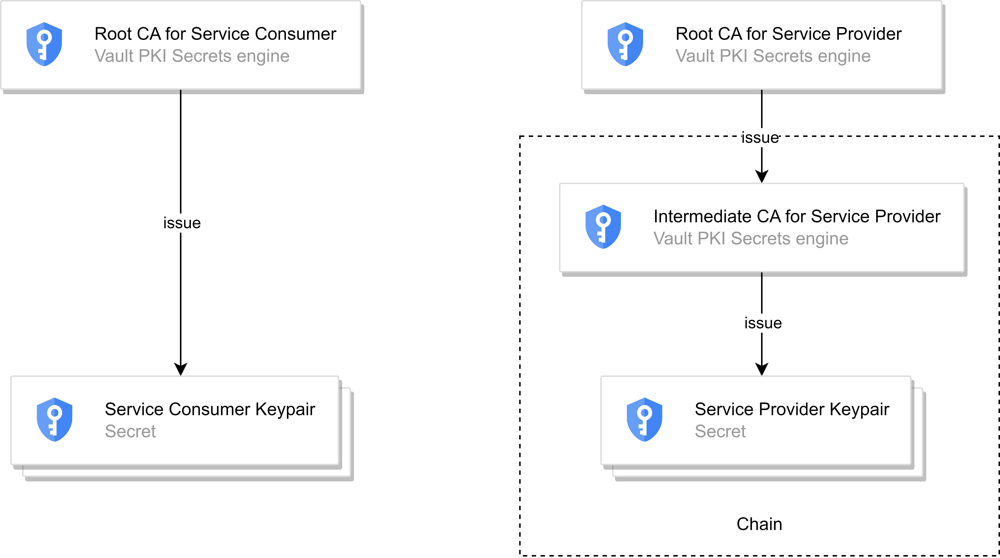
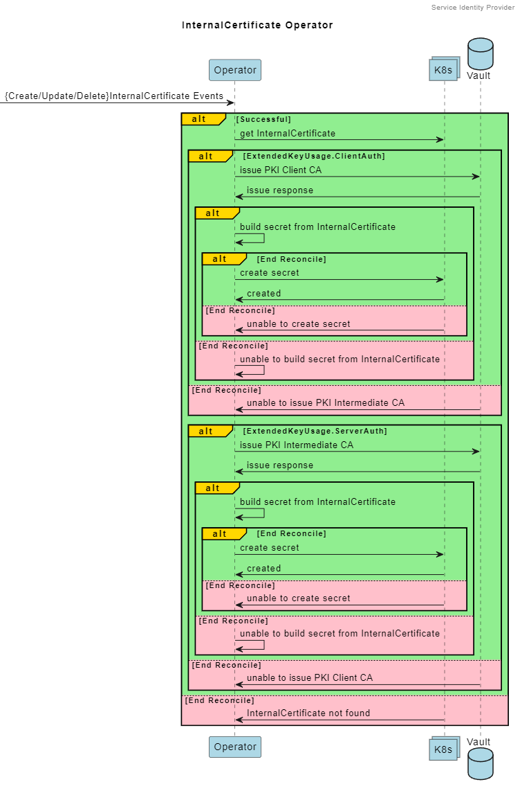
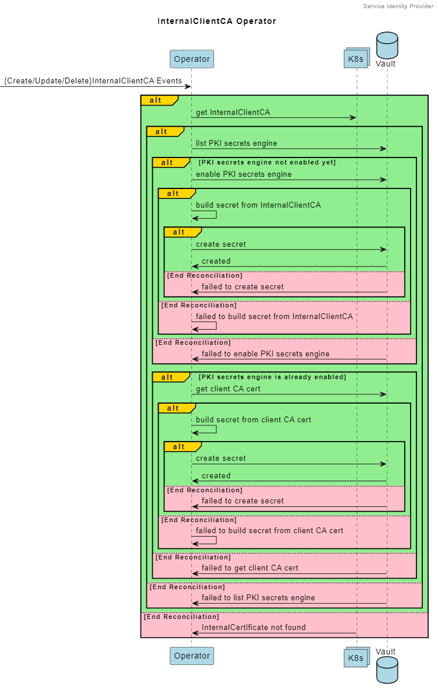

## Service-Identity-Provider

### Overiview

**Service-Identity-Provider (SIP)** provides X.509 keypair to secure Kubernetes in-cluster mTLS. By leveraging [PKI](https://developer.hashicorp.com/vault/docs/secrets/pki) secrets engine of HashiCorp [Vault](https://www.vaultproject.io/), the keypair(s) can be automatically provisioned without going through usual manual process of generation.

An application can request SIP for keypair needed to estabilish mTLS between **Service Provider** & **Service Consumer** (client of **Service Provider**) by declaring Kubernetes [Custom Resources](https://kubernetes.io/docs/concepts/extend-kubernetes/api-extension/custom-resources/) (CRs) according to Kubernetes [Custom Resource Definition](https://kubernetes.io/docs/tasks/extend-kubernetes/custom-resources/custom-resource-definitions/) (CRD).

The signature algorithms used for generating keypair is ECDSA-256 and SHA-256 for hash algorithm.

#### Use Cases

- Request internal certificate for server & client authentication.
- Request internal CA certificate for client authentication.

#### Features

- HashiCorp Vault [PKI](https://developer.hashicorp.com/vault/docs/secrets/pki) secrets engine
- Kubernetes [Opeartor pattern](https://kubernetes.io/docs/concepts/extend-kubernetes/operator/)
- [Kubebuilder](https://book.kubebuilder.io/)

#### Architecture

**Service Identity Provider** watches CRs created by **Service Provider** & **Service Consumer** & reconcile the secrets for mTLS.

**Serivce Provider** & **Service Consumer** (client of **Service Provider**) communicate with each other in mTLS given keypair in secrets.


#### Certificate Relationships

Root CA certficate for **Service Provide**r is shared by all **Service Consumers**.

Intermediate CA Certificate for **Service Provider** is shared by all **Service Providers**.



### Deployment

#### Prerequisite

An out-of-box Kubernetes cluster environment, try [kind](https://kind.sigs.k8s.io/). Note: 3 [workers](https://kind.sigs.k8s.io/docs/user/configuration/#nodes) are required for Vault HA.

Availability of [kubectl](https://kubernetes.io/docs/tasks/tools/#kubectl) CLI & [helm](https://helm.sh/), the package manager to interact with Kubernetes cluster.

#### CRD

A [CRD](https://www.vaultproject.io/) (Custom Resource Definition) is a way to **extend** the Kubernetes API to create custom resources. 

It allows users to define and manage new types of objects in their Kubernetes clusters.

Note: CRD is concisered cluster-wide resource, it is recommend to install them in a dedicated namespace.

```bash
$ kubectl create ns <namespace-for-crd>
$ helm install sip-crd \
	*.tgz \
	--namespace <namespace-for-crd> \
	--atomic
```

To verify

```bash
$ kubectl get crd | grep -e sip.sec.com
```

#### Vault

HashiCorp [Vault](https://www.vaultproject.io/) is an identity-based secrets and encryption management system.

A secret is anything that you want to tightly control access to. In our case, a X.509 certificate or key.

Note: [HA](https://developer.hashicorp.com/vault/docs/concepts/ha) is enabled against server outage.

```bash
$ helm install vault \
      *.tgz \
      --namespace <namespace>
```

To verify

```bash
$ helm ls -n <namespace>
$ helm status vault -n <namespace>
```

#### SIP

Note: namespace must be the same one as Vault.

```bash
$ helm install sip \
      *.tgz \
      --namespace <namespace>
```

To Verify

```bash
$ helm ls -n <namespace>
$ helm status vault -n <namespace>
```

### API

The API is used to enable X.509 certificate-based authentication & mTLS between **Service Provider** & **Service Consumer**.

The API that scaffoled by [Kubebuilder](https://book.kubebuilder.io/) sticks to [OpenAPI V3](https://swagger.io/specification/) & [K8s API Conventions](https://kubernetes.io/docs/reference/using-api/api-concepts/).

#### sip.sec.com/InternalCertificate

The **sip.sec.com/InternalCertificate** is used for generating PEM encoded keypair stored in Kubernetes Secrets for **Service Provider** & **Service Consumer**.

##### v1alpha

The following parameters/paths are supported (under CRD YAML `spec` section)

| Parameter/Path                          |  Type  | Is Mandatory | Description                                                  |
| :-------------------------------------- | :----: | :----------: | ------------------------------------------------------------ |
| certificate.extendedKeyUsage.ClientAuth |  bool  |     True     | It indicates the [extended key usage](https://golang.org/pkg/crypto/x509/#ExtKeyUsage) constraint on the issued certificate. Note: ClientAuth & ServerAuth cannot be both true or false. (Achieved by Validating Webhook) |
| certificate.extendedKeyUsage.ServerAuth |  bool  |     True     | It indicates the [extended key usage](https://golang.org/pkg/crypto/x509/#ExtKeyUsage) constraint on the issued certificate. Note: ClientAuth & ServerAuth cannot be both true or false. (Achieved by Validating Webhook) |
| certificate.issuer                      | string |    False     | It indicates the issuer of certificate. Note: mandatory if ClientAuth is true. (Achieved by Validating Webhook) |
| certificate.subject.cn                  | string |     True     | It indicates Common Name of certificate.                     |
| secret.certName                         | string |    False     | It indicates the name of certificate. Note: `tls.cert` is used if not given. (Achieved by Defaulting Webhook) |
| secret.keyName                          | string |    False     | It indicates the name of key. Note: `tls.key` is used if not given. (Achieved by Defaulting Webhook) |
| secret.name                             | string |     True     | It indicates the name of secret to create in Kubernetes cluster. |

#### sip.sec.com/InternalClientCA

The **sip.sec.com/InternalClientCA** is used for enabling Vault PKI secrets engine CA to issue client keypair for **Service Consumer**.

##### v1alpha

The following parameters/paths are supported (under CRD YAML `spec` section)

| Parameter/Path         |  Type  | Is Mandatory | Description                                                  |
| :--------------------- | :----: | :----------: | ------------------------------------------------------------ |
| certificate.subject.cn | string |     True     | It indicates Common Name of certificate.                     |
| secret.certName        | string |    False     | It indicates the name of certificate. Note: `client-ca.pem` is used if not given. (Achieved by Defaulting Webhook) |
| secret.name            | string |     True     | It indicates the name of secret to create in Kubernetes cluster. |

### Implementation

The core logics are implemented in the **Reconcile** function inside Operator (controller of Custom Resource) scaffolded by [Kubebuilder](https://book.kubebuilder.io/).

#### sip.sec.com/InternalCertificate



#### sip.sec.com/InternalClientCA



### Operation and Maintenance

TODO...

### Troubleshooting

TODO...

### Reference

[Vault PKI secrets engine (API)](https://developer.hashicorp.com/vault/api-docs/secret/pki)

[Kubernetes Custom Resources](https://kubernetes.io/docs/concepts/extend-kubernetes/api-extension/custom-resources)

[Kubebuilder](https://book.kubebuilder.io/)

### TODO...

- Certificate Renewal
- Decouple config from
- ++ more customizable fields for CR